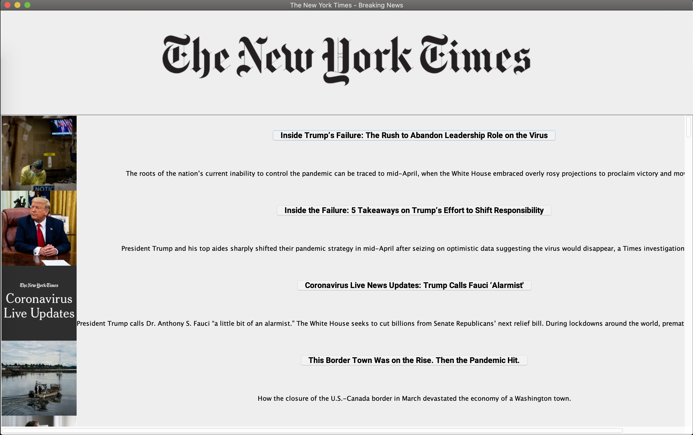

# NYTimes Desktop App

News reader for The New York Times meant for busy people who still want to stay up to date on the news. Allows users to quickly skim article headlines and descriptions.

Desktop app built in Java built with the Swing Java GUI Toolkit.
Data is taken from NYTimes RSS feeds.

Desktop screen shot:
