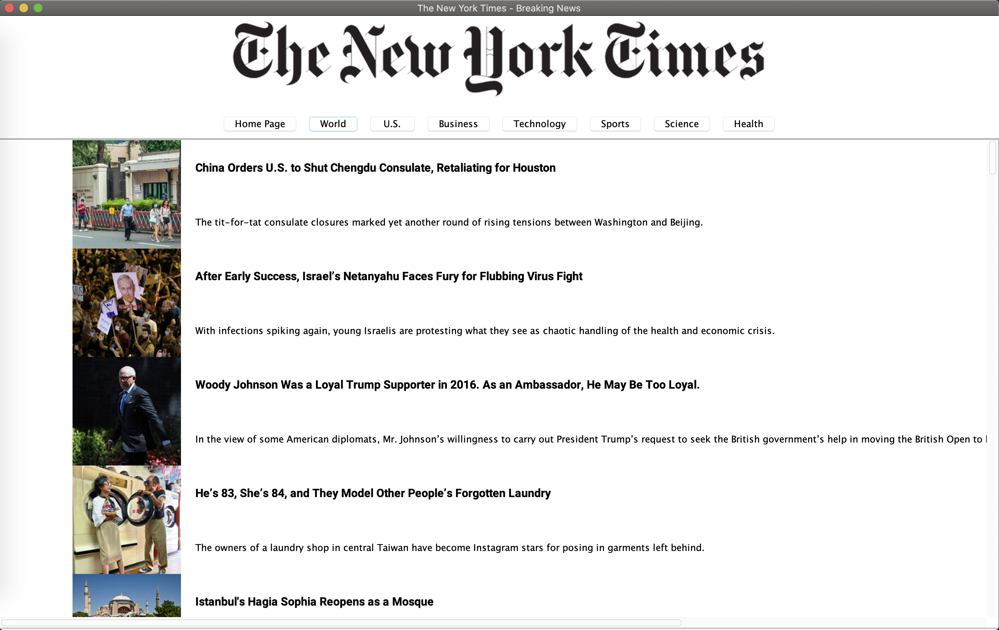

# The New York Times Desktop App

Unofficial News reader for The New York Times which allows users to skim current headlines and content.

Desktop app built in Java built with the Swing Java GUI Toolkit.
Data is taken from [NYTimes RSS feeds](https://archive.nytimes.com/www.nytimes.com/services/xml/rss/index.html).
This app uses Ohio State's CSE components to form and parse through XMLTrees.
More information about OSU's CSE API can be found [here](http://web.cse.ohio-state.edu/software/common/doc/).

### Screenshots:

### How to Install
<ol>
<li>Download the source code</li>
<li>Navigate to where the file is saved</li>
<li>Unzip the file and double click the .jar file to run</li>
<li>If the file doesn't run, open the command line and type: <pre>java -jar NYTimesReader.jar</pre></li>
</ol>